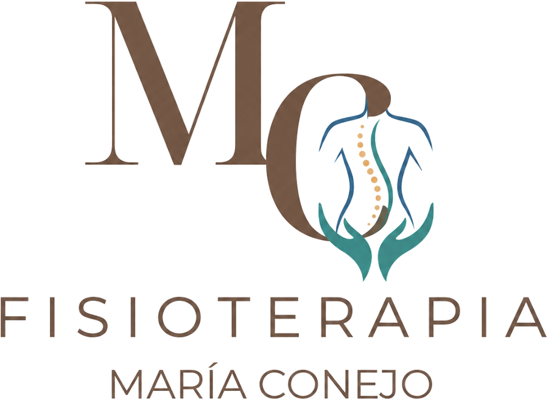
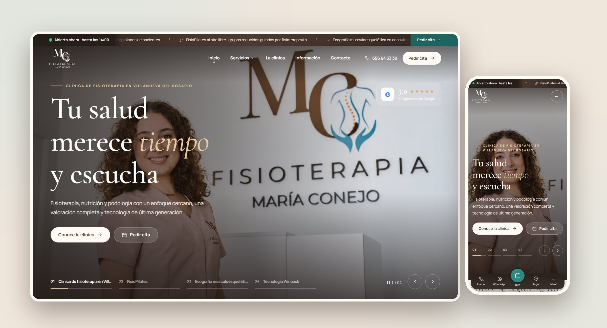

<p align="center">
  
</p>

<h3 align="center">Clínica de fisioterapia, nutrición y podología</h3>
<p align="center"><em>«Te acompañamos en el proceso»</em> · Villanueva del Rosario, Málaga</p>

<p align="center">
  <a href="https://sefiro888.github.io/ClinicaMariaConejo/"><strong>Ver la web en directo →</strong></a>
</p>

<p align="center">
  
  
  
</p>



## La clínica

En **Clínica María Conejo** trabajamos para que cada persona reciba una atención integral en su proceso de recuperación. Cada tratamiento empieza con una **valoración completa y personalizada**: tu historial, tus hábitos y tus necesidades. Con ella diseñamos un plan adaptado a ti para mejorar tu bienestar, recuperar tu movilidad y prevenir futuras lesiones.

La clínica cuenta con **ecógrafo de última generación** y **diatermia Winback**. Son herramientas que aportan precisión y seguridad, y permiten un seguimiento real de tu evolución.

**María Conejo Martín** es graduada en Fisioterapia y tiene un Máster en Fisioterapia Manual e Invasiva para el Tratamiento del Dolor y de la Disfunción por la Universidad de Granada. Además está especializada en fisioterapia pediátrica, atención temprana, neonatología y educación.

## Servicios

### 🤲 Fisioterapia
| Servicio | En qué consiste |
| --- | --- |
| Fisioterapia musculoesquelética | Alivio del dolor, recuperación de lesiones y mejora de la movilidad |
| Terapia manual | Técnicas manuales con objetivo clínico para movilidad y dolor |
| Ejercicio terapéutico | Recuperación activa con ejercicios para casa revisados en consulta |
| FisioPilates | Pilates clínico guiado por fisioterapeuta, en grupo reducido o individual, también al aire libre |
| Fisioterapia invasiva | Punción seca, electropunción y neuromodulación percutánea |
| Fisioterapia pediátrica | Cólico del lactante, deformidades craneales, desarrollo motor y asesoramiento de lactancia |
| Rehabilitación postquirúrgica | Recuperación tras cirugías ortopédicas y traumatológicas |
| Ecografía musculoesquelética | Imagen en tiempo real de músculos, tendones y ligamentos, sin radiación |
| Tecarterapia y diatermia Winback | Radiofrecuencia de alta, media y baja frecuencia |
| Fisioterapia a domicilio | Atención en casa para personas con movilidad reducida |

### 🍎 Nutrición
Valoración nutricional y antropometría · Planes de alimentación (pérdida o ganancia de peso, masa muscular) · Tratamiento nutricional de enfermedades (diabetes, hipertensión, colesterol, enfermedades digestivas, cáncer e intolerancias) · Nutrición deportiva · Educación nutricional.

### 🦶 Podología
Estudio de la pisada · Plantillas personalizadas · Órtesis de silicona · Quiropodia · Reconstrucción ungueal · Podología general y pie diabético · Podología a domicilio.

## Visítanos

| | |
| --- | --- |
| 📍 **Dirección** | C. Fuente Toril, 24 · 29312 Villanueva del Rosario, Málaga |
| 🕒 **Horario** | Lunes a jueves 11:00–14:00 y 15:00–21:00 · Viernes 11:00–14:00 y 15:00–20:00 |
| 📞 **Cita y WhatsApp** | [656 64 33 30](https://wa.me/34656643330) |
| 📸 **Redes** | [Instagram](https://www.instagram.com/fisiomariacm/) · [Facebook](https://www.facebook.com/p/Fisioterapia-Mar%C3%ADa-Conejo-61560371157858/) |

Acceso adaptado para silla de ruedas · Pago con tarjeta y móvil · Aparcamiento gratuito en la calle · Bonos y tarjetas regalo.

## Qué incluye la web

- **Barra de avisos en movimiento** con el estado «Abierto ahora / Cerrado», calculado con el horario real.
- **Pase de imágenes animado** en la portada y una cinta de servicios en movimiento.
- **Mega menú** con vista previa de cada servicio en escritorio, y **menú a pantalla completa** con barra de acciones fija en móvil.
- **Buscador «¿Qué te ocurre?»** que recomienda servicios según cada situación.
- **Tecnología interactiva**: niveles de Winback y ecografía.
- **Reels reales de Instagram**, que se reproducen en bucle en pantalla y con sonido al pulsarlos.
- **22 páginas de servicio**. Cada una tiene beneficios, para quién es, cómo es la sesión, qué traer, 6 preguntas frecuentes y reserva.
- **Reserva guiada en 3 pasos** que redacta el mensaje de WhatsApp. No guarda ningún dato.
- **Opiniones reales de Google**, normativa del centro, bonos, convenios con entidades locales y mapa que se carga solo al pulsarlo.
- Diseño adaptado a móvil, accesible y respetuoso con la opción «reducir movimiento».

## Estructura técnica

Sitio estático en HTML, CSS y JavaScript, sin dependencias. Se genera con Python:

```bash
python build.py      # genera las 31 páginas desde content.py
python check.py      # comprueba enlaces e imágenes
python -m http.server 8765   # vista local en http://localhost:8765
```

| Archivo | Función |
| --- | --- |
| `content.py` | Todos los textos: servicios, preguntas, horario, reseñas, normativa y equipo |
| `build.py` | Plantillas HTML |
| `assets/css/style.css` · `assets/js/site.js` | Diseño e interacción |
| `prepare_brand.py` · `prepare_assets.py` · `prepare_reels.py` | Preparan logotipos, fotos y vídeos desde el material original de la clínica |

---

<p align="center"><sub>Web de demostración · Las fotografías y los vídeos pertenecen a Fisioterapia María Conejo (vídeo «Cuidamos de ti y de los tuyos»: @fofilms.es).</sub></p>
